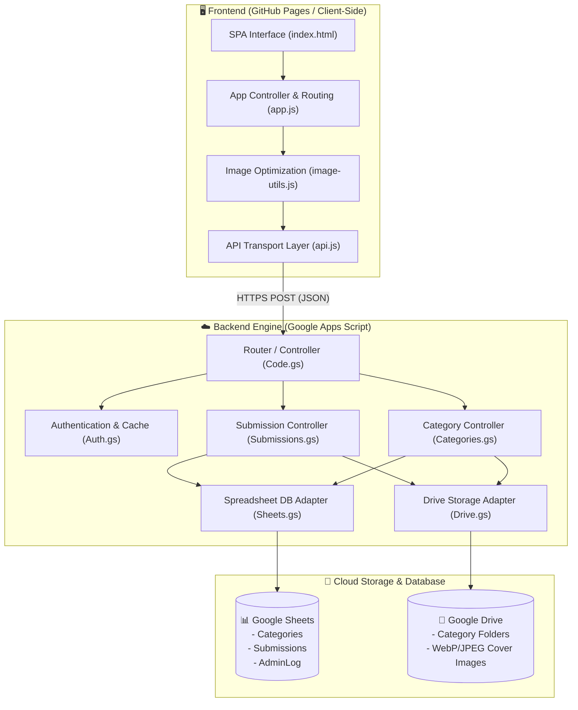

<p align="center">
  
</p>

<h1 align="center">🚀 Hongson Student Innovators</h1>

<p align="center">
  <strong>ศูนย์รวมเว็บแอปพลิเคชันและผลงานนวัตกรรมสร้างสรรค์ของนักเรียน</strong><br>
  <em>Student WebApp Showcase & Innovation Hub</em>
</p>

<p align="center">
  
  
  
  
  
</p>

<p align="center">
  <a href="#-ภาพรวมโครงการ">ภาพรวม</a> •
  <a href="#-จุดเด่นและฟีเจอร์">ฟีเจอร์เด่น</a> •
  <a href="#-สถาปัตยกรรมระบบ">สถาปัตยกรรม</a> •
  <a href="#-โครงสร้างโปรเจกต์">โครงสร้างไฟล์</a> •
  <a href="#-การติดตั้งและใช้งาน">วิธีติดตั้ง</a> •
  <a href="#-ผู้พัฒนา">ผู้พัฒนา</a>
</p>

---

## 🌟 ภาพรวมโครงการ (About The Project)

**Hongson Student Innovators** คือแพลตฟอร์ม Web Application ในรูปแบบ **Serverless Jamstack** ที่ถูกพัฒนาขึ้นเพื่อเป็นพื้นที่จัดแสดง รวบรวม และส่งต่อผลงานเว็บแอปพลิเคชันของนักเรียน โดยเปิดกว้างสำหรับผลงานสร้างสรรค์ทุกรูปแบบ ไม่จำกัดเฉพาะเกม เช่น:

* 🎮 **เกมการเรียนรู้ (Learning Games):** สื่อการสอนแบบ Interactive และเกมจำลองสถานการณ์
* 🩺 **แอพสุขภาพและโภชนาการ (Health & Wellness Apps):** เครื่องมือคำนวณแคลอรี ดัชนีมวลกาย BMI และติดตามการออกกำลังกาย
* 🧮 **เครื่องมือคำนวณและวิทยาศาสตร์ (Calculators & Tools):** โปรแกรมคำนวณทางคณิตศาสตร์ ฟิสิกส์ และดาราศาสตร์
* 💡 **นวัตกรรมดิจิทัล & AI (Digital Innovations):** โปรเจกต์ AI, เว็บแอปแปลภาษา, เครื่องมือสืบค้น และสารสนเทศท้องถิ่น

ระบบสามารถทำงานได้สมบูรณ์โดย**ไม่มีค่าใช้จ่ายด้านเซิร์ฟเวอร์ (Zero Hosting Cost)** โดยนำ **Google Sheets** มาใช้เป็นฐานข้อมูลเชิงสัมพันธ์ และใช้ **Google Drive** เป็นระบบจัดเก็บไฟล์ภาพหน้าปกผลงาน พร้อมความสามารถในการทำงานแบบ Offline / Mock Mode สำหรับทดสอบหน้าบ้านได้ทันที

---

## ✨ จุดเด่นและฟีเจอร์สำคัญ (Key Features)

### 1. ประสบการณ์ผู้ใช้งานที่ทันสมัย (Modern UI/UX & Aesthetics)
* **Glassmorphism Design:** ดีไซน์การ์ดโปร่งแสง ผสานพาเล็ตสี Cyan, Sky Blue, Navy และ Emerald ที่สอดรับกับโลโก้ทางการ
* **Responsive Layout:** รองรับการใช้งานอย่างไร้รอยต่อทั้งบนสมาร์ตโฟน แท็บเล็ต และคอมพิวเตอร์เดสก์ท็อป
* **Micro-interactions:** เอฟเฟกต์โฮเวอร์การ์ด การย่อขยายปุ่ม และไฟสถานะกระพริบแบบนุ่มนวล

### 2. ระบบคัดแยกและค้นหาอัจฉริยะ (Smart Filter & Sorting)
* **Thai Alphabetical & Numeric Sorting:** อัลกอริทึมเรียงลำดับผลงานตาม **เลขที่ของนักเรียน (น้อยไปมาก)** และใช้ **การเรียงพยัญชนะไทย (ก-ฮ)** ผ่าน `Intl.Collator('th')` เป็นตัวตัดสินกรณีเลขที่ซ้ำกัน
* **Real-time Search with Debounce:** ค้นหาตามชื่อผลงาน, ชื่อผู้สร้าง, เลขที่, หรือห้องเรียน โดยมีระบบ Debounce 150ms ช่วยลดการคำนวณซ้ำซ้อน

### 3. การบีบอัดรูปภาพฝั่งผู้ใช้ (Client-Side Image Optimization)
* ประมวลผลและลดขนาดไฟล์ภาพหน้าปกก่อนส่งขึ้นเซิร์ฟเวอร์ด้วย **HTML5 Canvas** (แปลงเป็น WebP/JPEG อัตโนมัติ)
* ช่วยลดขนาดไฟล์ภาพจาก 5–10 MB ให้เหลือเพียง **100–300 KB** ลดเวลาอัปโหลดและประหยัดพื้นที่บน Google Drive

### 4. ระบบจัดการผู้ดูแลระบบ (Admin Mode)
* **Session Management:** ล็อกอินด้วย Master Password และรับ Session Token อายุ 60 นาทีผ่าน `CacheService`
* **Category Management:** สร้าง, แก้ไข, เปิด-ปิดรับผลงาน, และลบหัวข้อแบบ Soft Delete
* **Submission Moderation:** ลบผลงานที่ไม่เหมาะสม พร้อมล้างไฟล์ภาพบน Google Drive โดยอัตโนมัติ
* **Audit Trail:** บันทึกประวัติการกระทำของผู้ดูแลทุกขั้นตอนลงแท็บ `AdminLog`

### 5. ความปลอดภัยและเสถียรภาพ (Security & Reliability)
* **Formula Injection Prevention:** ฟังก์ชัน `sanitizeForSheet` ดักจับอักขระ `=`, `+`, `-`, `@` เพื่อป้องกัน CSV/Spreadsheet Injection
* **Honeypot Anti-Bot:** ช่องดักบอตสแปมแบบซ่อน ป้องกันสคริปต์ก่อกวน
* **Concurrency Lock:** ควบคุมธุรกรรมการเขียนข้อมูลด้วย `LockService` ป้องกัน Race Condition
* **Network Timeout:** ตั้งเวลา Timeout 30 วินาที พร้อมระบบแจ้งเตือนข้อผิดพลาดที่เข้าใจง่าย

---

## 🏛️ สถาปัตยกรรมระบบ (System Architecture)



---

## 📁 โครงสร้างโปรเจกต์ (Project Structure)

```text
Hongson-WebApp-Innovators/
├── Logo/
│   └── Student Web App Logo.png      # โลโก้ทางการของระบบ
├── appscript/                         # ซอร์สโค้ดฝั่ง Google Apps Script Backend
│   ├── Auth.gs                       # ระบบตรวจสอบสิทธิ์และเซสชันผู้ดูแล
│   ├── Bridge.html                   # ไฟล์บริดจ์สำรองสำหรับ CORS / Iframe
│   ├── Categories.gs                 # จัดการหมวดหมู่และหัวข้อการส่งงาน
│   ├── Code.gs                       # จุดรับ Request (doGet, doPost, Router)
│   ├── Config.gs                     # อ่านค่าตัวแปรจาก Script Properties
│   ├── Drive.gs                      # สร้างโฟลเดอร์และอัปโหลดรูปภาพสู่ Drive
│   ├── Sheets.gs                     # จัดการตารางข้อมูลและการสร้าง Database อัตโนมัติ
│   ├── Submissions.gs                # ตรวจสอบและบันทึกผลงานของนักเรียน
│   └── Utils.gs                      # ฟังก์ชัน UUID, Sanitize, Format, และ Log
├── assets/
│   ├── css/
│   │   └── styles.css                # ดีไซน์ระบบ, Glassmorphism, Animations, และ Responsive
│   ├── images/
│   │   ├── logo.png                  # สำเนาโลโก้สำหรับ Web Path
│   │   └── placeholder-cover.svg     # ภาพหน้าปกเริ่มต้นแบบ WebApp Mockup
│   └── js/
│       ├── admin.js                  # ลอจิกการทำงานของระบบผู้ดูแลระบบ
│       ├── api.js                    # ตัวกลางรับส่งข้อมูล (รองรับทั้ง Mock Mode และ Live API)
│       ├── app.js                    # ลอจิกหลักหน้าเว็บ, ค้นหา, คัดกรอง และ SPA Routing
│       ├── config.js                 # ค่ากำหนดฝั่ง Frontend (API URL, ขนาดภาพ)
│       └── image-utils.js            # ระบบย่อและบีบอัดรูปภาพด้วย HTML5 Canvas
├── index.html                        # หน้าเว็บหลัก Single Page Application (SPA)
├── SETUP.md                          # คู่มืออย่างละเอียดสำหรับการตั้งค่า Google Services
└── README.md                         # เอกสารแนะนำและภาพรวมของโครงการ
```

---

## 🚀 การติดตั้งและใช้งาน (Getting Started)

### 1. เปิดใช้งานแบบทดสอบ (Local Development / Mock Mode)
หากดาวน์โหลดโปรเจกต์มาไว้ในเครื่อง คุณสามารถเปิดดูและทดสอบระบบได้ทันทีโดยไม่ต้องตั้งค่า Backend (ระบบจะจำลอง Mock Data ให้โดยอัตโนมัติ):

```bash
# รัน Local Server ด้วย Node.js (หรือโปรแกรมเว็บเซิร์ฟเวอร์ใด ๆ)
npx serve .
# หรือเปิดไฟล์ index.html ผ่านเว็บเบราว์เซอร์ได้โดยตรง
```

> **รหัสผ่านผู้ดูแลในโหมดทดสอบ (Prototype Mock Mode):** `admin1234`

### 2. การเชื่อมต่อกับฐานข้อมูลจริง (Production Deployment)
1. ทำตามขั้นตอนการเตรียม Google Sheets, Google Drive และ Google Apps Script ในไฟล์ [SETUP.md](SETUP.md)
2. เมื่อได้ **Web App URL** จากการ Deploy ใน Google Apps Script (URL ที่ลงท้ายด้วย `/exec`) ให้นำมาใส่ในไฟล์ `assets/js/config.js`:

```javascript
const APP_CONFIG = {
  // นำ URL ของ Apps Script ที่ Deploy เรียบร้อยแล้วมาวางที่นี่
  API_URL: "https://script.google.com/macros/s/AKfycb.../exec",
  
  APP_NAME: "Hongson Student Innovators",
  APP_SUBTITLE: "ศูนย์รวมเว็บแอปพลิเคชันและผลงานสร้างสรรค์ของนักเรียน",
  ...
};
```

---

## 📋 ข้อมูลสเปก API (API Actions Reference)

| Action | Method | Parameter สำคัญ | สิทธิ์ | คำอธิบาย |
| :--- | :---: | :--- | :---: | :--- |
| `healthCheck` | `GET` | - | Public | ตรวจสอบสถานะการเชื่อมต่อของ Sheet และ Drive |
| `getCategories` | `GET` | - | Public | ดึงรายชื่อหัวข้อทั้งหมดพร้อมจำนวนผลงาน |
| `getCategory` | `GET` | `categoryId` | Public | ดึงข้อมูลเฉพาะของหัวข้อที่ระบุ |
| `getSubmissions`| `GET` | `categoryId` | Public | ดึงรายการผลงานที่ส่งในหัวข้อนั้น |
| `submitWork` | `POST` | ข้อมูลนักเรียน, URL, ภาพ Base64 | Public | บันทึกการส่งงานและอัปโหลดภาพปกขึ้น Drive |
| `adminLogin` | `POST` | `password` | Public | ตรวจสอบรหัสผ่านผู้ดูแลและออก Session Token |
| `adminLogout` | `POST` | `token` | Admin | ยกเลิก Session Token |
| `createCategory` | `POST` | `token`, `title`, `description` | Admin | สร้างหัวข้อใหม่และสร้างโฟลเดอร์ Drive อัตโนมัติ |
| `updateCategory` | `POST` | `token`, `categoryId`, ข้อมูลที่แก้ | Admin | แก้ไขชื่อ คำอธิบาย หรือสถานะเปิด/ปิดรับงาน |
| `deleteCategory` | `POST` | `token`, `categoryId` | Admin | ลบหัวข้อ (Soft Delete) |
| `deleteSubmission`| `POST`| `token`, `submissionId` | Admin | ลบผลงานและย้ายภาพใน Drive ลงถังขยะ |

---

## 👨‍💻 ผู้พัฒนา (Developer)

<div align="center">
  <p><strong>พัฒนาโดย: นายสาธิต ศิริวัชน์ (COOLNUT)</strong></p>
  <p><em>สร้างสรรค์เพื่อส่งเสริมศักยภาพด้านดิจิทัล นวัตกรรม และวิทยาการคำนวณของนักเรียน</em></p>
  <p>© Hongson Student Innovators — All Rights Reserved</p>
</div>
